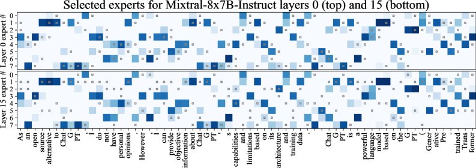
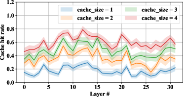
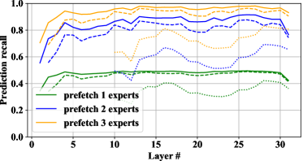

# Fast Inference of Mixture-of-Experts Language Models with Offloading

> **原文链接:** [arXiv:2312.17238](https://arxiv.org/abs/2312.17238)
>
> **作者:** Artyom Eliseev, Denis Mazur
>
> **发表:** 2023
>
> **主题:** MoE 模型权重 offload 到 SSD/CPU，在消费级硬件上运行大型 MoE 模型

---

## Abstract

Mixture-of-Experts (MoE) language models have recently become an effective architecture for scaling model capacity while maintaining tractable training and inference costs. As these models grow, running them on consumer hardware becomes increasingly challenging due to their sheer size. In this work, we study the problem of running large MoE language models on hardware where only a fraction of experts can fit into accelerator memory. We observe that sparse MoE models activate only a subset of layers per input, enabling faster generation than dense alternatives. However, their larger footprint makes them challenging for devices with limited GPU memory. We propose a novel strategy that accelerates offloading by taking advantage of innate properties of MoE LLMs, enabling deployment of Mixtral-8x7B with mixed quantization on desktop computers and free-tier Google Colab instances.

## 摘要

混合专家 (MoE) 语言模型最近已成为一种有效的架构，能够在保持可控的训练和推理成本的同时扩展模型容量。随着这些模型的增长，由于其庞大的规模，在消费级硬件上运行它们变得越来越具有挑战性。在这项工作中，我们研究了在仅有部分专家能够放入加速器内存的硬件上运行大型 MoE 语言模型的问题。我们观察到稀疏 MoE 模型每次输入仅激活一部分层，使得生成速度比密集模型更快。然而，其更大的内存占用使其在 GPU 内存有限的设备上具有挑战性。我们提出了一种新策略，利用 MoE LLM 的固有特性来加速 offloading，实现在桌面计算机和免费 Google Colab 实例上部署混合量化的 Mixtral-8x7B。

---

## 1. Introduction / 引言

Large Mixture-of-Experts models like Mixtral-8x7B represent a significant advancement in language model scaling. By activating only 2 out of 8 experts per token, these models achieve strong performance while keeping per-token computation costs manageable. However, the total parameter count (46.7B for Mixtral-8x7B) means the full model requires substantial memory, far exceeding what consumer GPUs typically offer (12-16GB VRAM).

大型混合专家模型如 Mixtral-8x7B 代表了语言模型扩展的重大进步。通过每个 token 仅激活 8 个专家中的 2 个，这些模型在保持可控的单 token 计算成本的同时实现了强大的性能。然而，总参数量（Mixtral-8x7B 为 46.7B）意味着完整模型需要大量内存，远超消费级 GPU 通常提供的容量（12-16GB 显存）。

---

## 2. Key Technical Contributions / 核心技术贡献

### 2.1 Expert Locality Observation / 专家局部性观察

*图 1：Mixtral-8x7B-Instruct 中的专家加载模式。蓝色单元格表示某个专家在编码某个 token 时被激活；蓝色越深表示门控权重越高。灰色小方块表示在 k=2 的 LRU 缓存中哪些专家被缓存。*

The researchers discovered that MoE models exhibit reusable experts across adjacent tokens. Some experts activate in sequences of 2-4 tokens, creating opportunities for caching rather than constant reloading from host RAM or SSD.

研究者发现 MoE 模型在相邻 token 之间展现出可复用的专家。某些专家在连续 2-4 个 token 中被激活，这为缓存而非从主机 RAM 或 SSD 持续重新加载创造了机会。

### 2.2 LRU Caching Strategy / LRU 缓存策略

An LRU (Least Recently Used) cache keeps k cached experts per layer in GPU memory:

- **k=2**: suitable for 12GB GPUs
- **k=4**: suitable for 16GB GPUs

This significantly reduces GPU-RAM communication overhead by keeping frequently accessed experts readily available.

LRU（最近最少使用）缓存在 GPU 内存中为每层保留 k 个缓存的专家：

- **k=2**: 适用于 12GB GPU
- **k=4**: 适用于 16GB GPU

这通过保持频繁访问的专家随时可用，显著减少了 GPU-RAM 通信开销。

*图 2：左图为不同缓存大小 k 的 LRU 缓存命中率；右图为预加载不同数量专家时的推测性加载召回率（实线=提前 1 层，虚线=提前 2 层，点线=提前 10 层）*

### 2.3 Speculative Expert Loading / 推测性专家加载

Since traditional pre-fetching cannot work with MoE (experts are selected just-in-time by the gating function), the authors developed speculative loading: applying the next layer's gating function to the current layer's hidden states to predict likely experts ahead of time, enabling pre-loading before they are actually needed.

由于传统预取技术无法应用于 MoE（专家由门控函数即时选择），作者开发了推测性加载：将下一层的门控函数应用于当前层的隐藏状态，提前预测可能需要的专家，从而在实际需要之前进行预加载。

### 2.4 Quantization Scheme / 量化方案

The system uses differentiated quantization:

- **Attention layers**: 4-bit quantization (always active, kept in GPU memory)
- **Expert layers**: 2-3 bit quantization using Half Quadratic Quantization (HQQ) algorithm

This mixed approach minimizes the memory footprint while preserving model quality for the most critical components.

系统使用差异化量化：

- **注意力层**: 4-bit 量化（始终活跃，保留在 GPU 内存中）
- **专家层**: 使用半二次量化 (HQQ) 算法的 2-3 bit 量化

这种混合方法在为最关键组件保留模型质量的同时，最大限度地减少了内存占用。

### 2.5 System Implementation / 系统实现

- Splits experts between host RAM and GPU memory (在主机 RAM 和 GPU 内存之间分配专家)
- Allocates contiguous memory buffers for faster transfers (分配连续内存缓冲区以加速传输)
- Uses 4 temporary buffers for asynchronous copying (使用 4 个临时缓冲区进行异步复制)

---

## 3. Experiments / 实验

*图 3：系统架构与基准测试结果*

### 3.1 Results / 实验结果

| Hardware | Speed (tokens/s) |
|----------|-------------------|
| T4 GPU (Google Colab) | ~2.0 |
| RTX 3060 | ~2.3 |
| RTX 3080 Mobile | ~2.7 |
| A100 (reference) | ~3.0 |

LRU caching combined with speculative loading outperformed naive offloading by approximately **2x** across all configurations.

LRU 缓存结合推测性加载在所有配置中比朴素 offloading 提速约 **2 倍**。

---

## 4. Conclusion / 结论

This work demonstrates that large MoE language models can be made accessible on consumer hardware through intelligent offloading strategies. The key insight is that the inherent sparsity and expert locality patterns of MoE models can be exploited for efficient caching and speculative loading. By combining LRU caching, speculative expert prediction, and mixed quantization, the system achieves practical generation speeds for Mixtral-8x7B on hardware as modest as a free-tier Google Colab instance.

本文证明了通过智能 offloading 策略，大型 MoE 语言模型可以在消费级硬件上运行。核心洞察是 MoE 模型固有的稀疏性和专家局部性模式可以被利用来实现高效缓存和推测性加载。通过结合 LRU 缓存、推测性专家预测和混合量化，该系统在低至免费 Google Colab 实例的硬件上实现了 Mixtral-8x7B 的实用生成速度。
