# LLM in a Flash: Efficient Large Language Model Inference with Limited Memory

> **原文链接:** [arXiv:2312.11514](https://arxiv.org/abs/2312.11514)
>
> **作者:** Keivan Alizadeh, Iman Mirzadeh, Dmitry Belenko, Karen Khatamifard, Minsik Cho, Carlo C Del Mundo, Mohammad Rastegari, Mehrdad Farajtabar (Apple)
>
> **发表:** ACL 2024
>
> **主题:** 利用 Flash Memory 在内存受限设备上高效运行大语言模型

---

## Abstract

Large language models (LLMs) are central to a wide range of natural language processing tasks. However, their substantial computational and memory requirements present challenges, particularly for devices with limited DRAM capacity. This paper tackles the challenge of efficiently running LLMs that exceed the available DRAM capacity by storing the model parameters in flash memory and bringing them on demand to DRAM. Our method involves constructing an inference cost model that takes into account the characteristics of flash memory, guiding us to optimize in two critical areas: reducing the volume of data transferred from flash and reading data in larger, more contiguous chunks. Within this hardware-informed framework, we introduce two principal techniques. First, "windowing" strategically reduces data transfer by reusing previously activated neurons, and second, "row-column bundling", tailored to the sequential read strengths of flash memory, increases the size of data chunks read from flash memory. These methods collectively enable running models up to twice the size of the available DRAM, with a 4-5x and 20-25x increase in inference speed compared to naive loading approaches in CPU and GPU, respectively.

## 摘要

大语言模型 (LLM) 是各种自然语言处理任务的核心。然而，其巨大的计算和内存需求带来了挑战，尤其是对于 DRAM 容量有限的设备。本文解决了在可用 DRAM 容量不足的情况下高效运行 LLM 的挑战，方法是将模型参数存储在 flash memory 中，并按需加载到 DRAM。我们的方法包括构建一个考虑了 flash memory 特性的推理成本模型，引导我们在两个关键领域进行优化：减少从 flash 传输的数据量，以及以更大、更连续的块读取数据。在这个硬件感知的框架下，我们引入了两项核心技术。第一项是"窗口化 (windowing)"，通过复用先前激活的神经元来策略性地减少数据传输；第二项是"行列捆绑 (row-column bundling)"，针对 flash memory 的顺序读取优势而设计，增大从 flash memory 读取的数据块大小。这些方法共同实现了运行最大为可用 DRAM 两倍大小的模型，在 CPU 和 GPU 上分别实现了 4-5 倍和 20-25 倍的推理速度提升（相比朴素加载方法）。

---

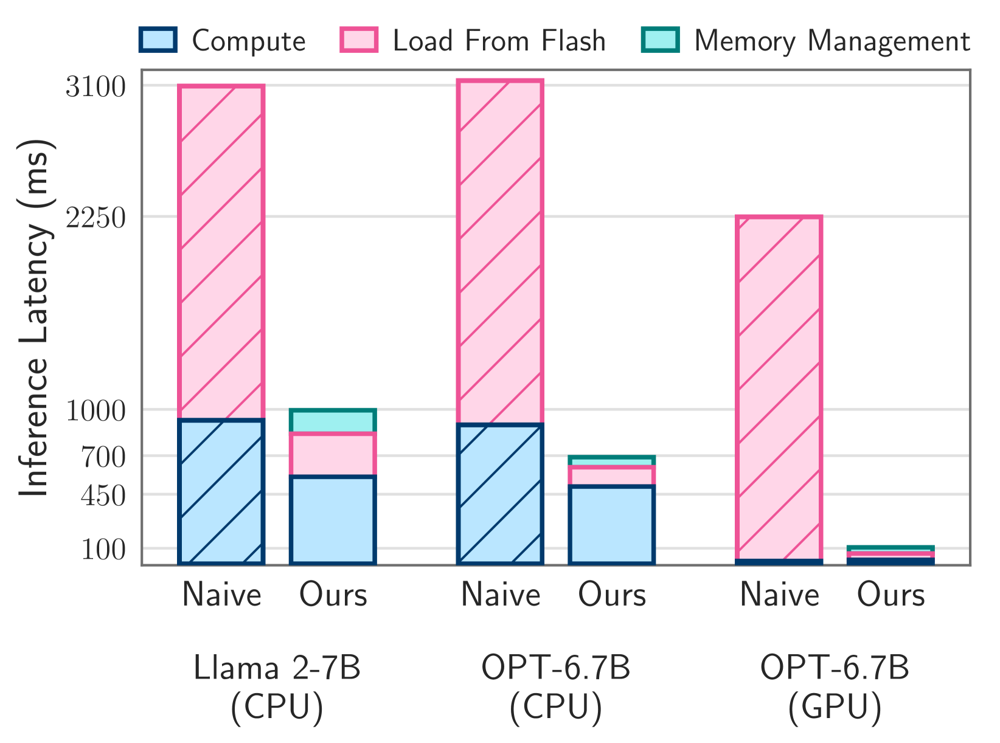

*图 1：当仅有模型一半内存可用时，单个 token 的平均推理延迟*

---

## 1. Introduction

The rapid advancements in large language models (LLMs) have led to models with remarkable capabilities. However, these models' sizable memory requirements pose significant challenges, especially when deploying them on resource-constrained devices. The trend of increasing model sizes exacerbates this issue, creating a pressing need for innovative solutions to enable efficient use of LLMs in environments where memory is a bottleneck.

## 1. 引言

大语言模型 (LLM) 的快速发展产生了具有卓越能力的模型。然而，这些模型庞大的内存需求带来了重大挑战，尤其是在资源受限的设备上部署时。模型规模不断增大的趋势加剧了这一问题，迫切需要创新解决方案来在内存成为瓶颈的环境中高效使用 LLM。

---

## 2. Key Technical Contributions / 核心技术贡献

### 2.1 Problem Formulation / 问题建模

The central challenge lies in the disparity between the memory requirements of LLMs and the available DRAM on many devices. While flash memory offers ample storage capacity, its read throughput is significantly lower than DRAM, making naive approaches of loading entire model parameters from flash impractical for real-time inference.

核心挑战在于 LLM 的内存需求与许多设备可用 DRAM 之间的差距。虽然 flash memory 提供了充足的存储容量，但其读取吞吐量远低于 DRAM，使得从 flash 朴素加载整个模型参数在实时推理中不可行。

### 2.2 Hardware-Aware Cost Model / 硬件感知成本模型

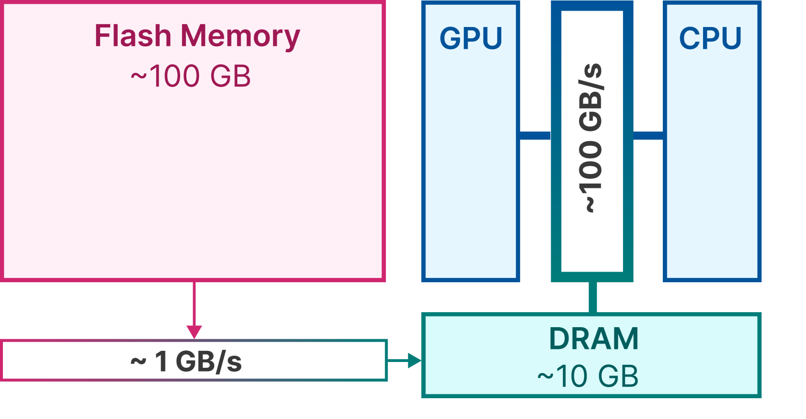

*图 2a：统一内存架构中的带宽*

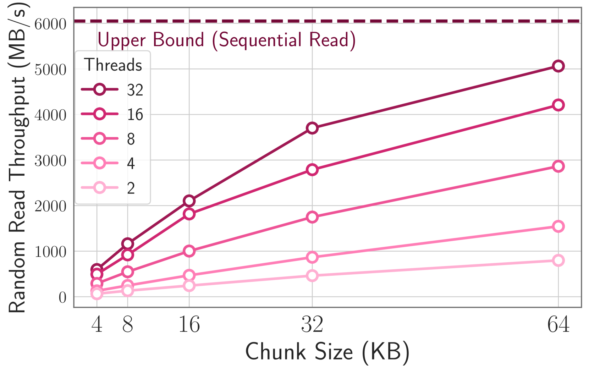

*图 2b：Flash memory 的随机读取吞吐量*

The authors develop a cost model that accounts for flash memory characteristics:

- **Sequential reads** are significantly faster than random reads on flash
- **Read granularity** matters — flash performs optimally with large sequential reads
- **Multi-phase overhead** for random small reads includes address setup, data transfer, and error correction

作者开发了一个考虑 flash memory 特性的成本模型：

- **顺序读取**在 flash 上比随机读取快得多
- **读取粒度**很重要 — flash 在大块顺序读取时性能最优
- 随机小块读取的**多阶段开销**包括地址设置、数据传输和纠错

### 2.3 Reducing Data Transfer / 减少数据传输

The approach leverages activation sparsity (97% in OPT 6.7B FFN layers):

1. **Selective persistence** — attention weights are kept in DRAM since they are always accessed
2. **Low-rank predictors** — small neural networks predict which neurons will be activated, enabling pre-loading of only necessary parameters
3. **Sliding window technique** — maintains only recently-activated neuron weights in DRAM, evicting neurons that haven't been used within the window

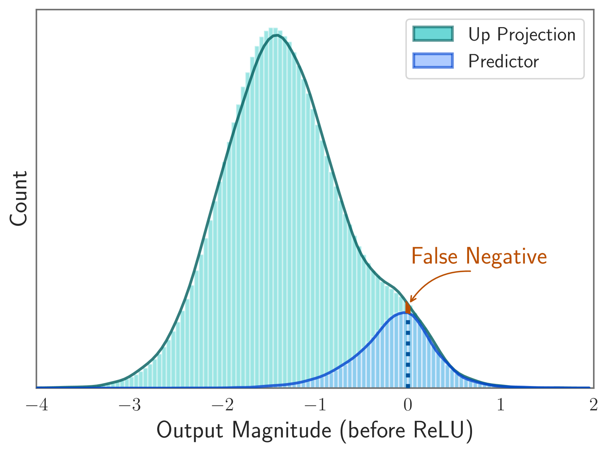

*图 3a：OPT 6.7B 中 token 的预测器 vs ReLU 预激活对比*

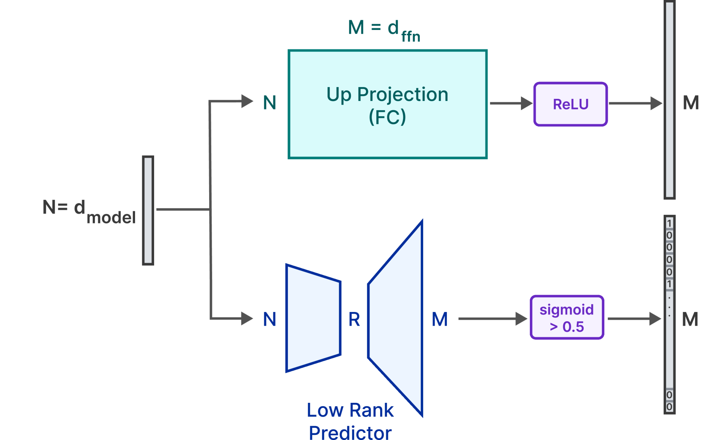

*图 3b：低秩预测器识别哪些中间神经元将被激活*

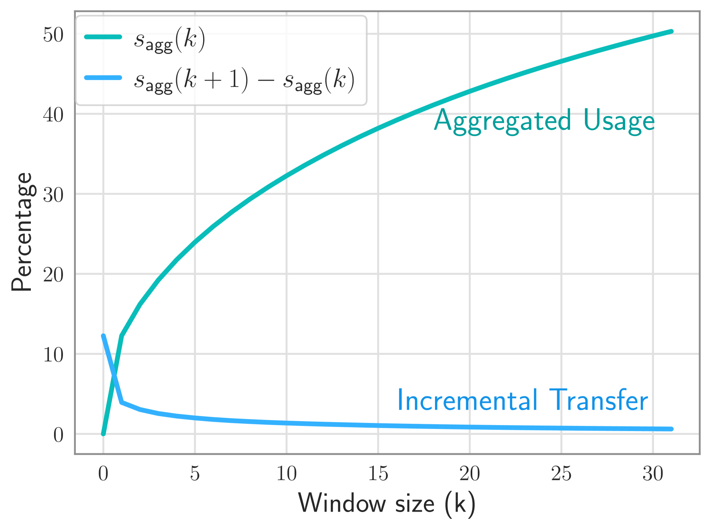

*图 4a：Falcon 7B 第十层的聚合神经元使用情况*

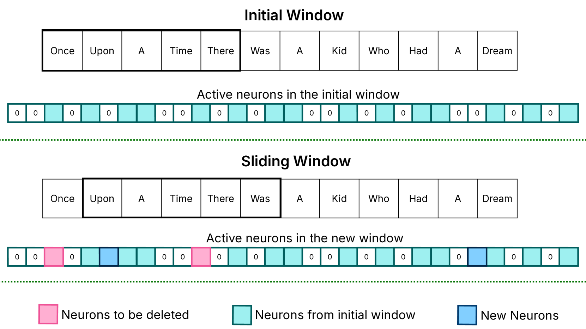

*图 4b：滑动窗口技术维护过去 k 个 token 的活跃神经元*

该方法利用激活稀疏性（在 OPT 6.7B 的 FFN 层中高达 97%）：

1. **选择性持久化** — 注意力权重保留在 DRAM 中，因为它们总是被访问
2. **低秩预测器** — 小型神经网络预测哪些神经元将被激活，从而仅预加载必要的参数
3. **滑动窗口技术** — 仅在 DRAM 中保留最近激活的神经元权重，驱逐窗口内未被使用的神经元

### 2.4 Row-Column Bundling / 行列捆绑

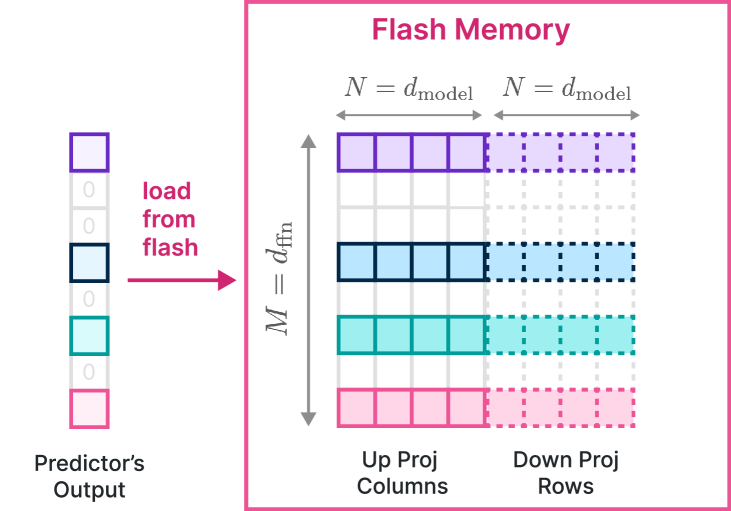

*图 5：将上投影矩阵的列与下投影矩阵的行进行捆绑*

To exploit flash memory's sequential read strengths, the authors store up-projection columns together with corresponding down-projection rows. This bundling strategy effectively doubles the chunk size for each read operation, reducing the number of individual read requests and leveraging sequential access patterns.

为了利用 flash memory 的顺序读取优势，作者将上投影矩阵的列与对应的下投影矩阵的行存储在一起。这种捆绑策略有效地将每次读取操作的数据块大小翻倍，减少了单独读取请求的次数，并利用了顺序访问模式。

### 2.5 Optimized DRAM Management / 优化的 DRAM 管理

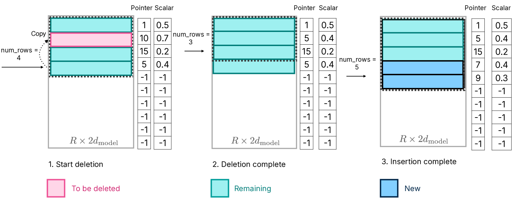

*图 6：内存管理 — 替换元素并堆叠新权重*

The system uses efficient data structures with preallocation and pointer-based neuron tracking to minimize memory reallocation overhead. Reading is parallelized across 32 threads to amortize latency-to-first-byte costs.

系统使用预分配和基于指针的神经元跟踪的高效数据结构，以最小化内存重新分配开销。读取操作在 32 个线程之间并行化，以分摊首字节延迟成本。

---

## 3. Experiments / 实验

### 3.1 Setup / 实验设置

Testing conducted on OPT 6.7B, Falcon 7B, and other models across Apple M1 Max, M2 Ultra, and NVIDIA RTX 4090 hardware.

在 Apple M1 Max、M2 Ultra 和 NVIDIA RTX 4090 硬件上对 OPT 6.7B、Falcon 7B 等模型进行测试。

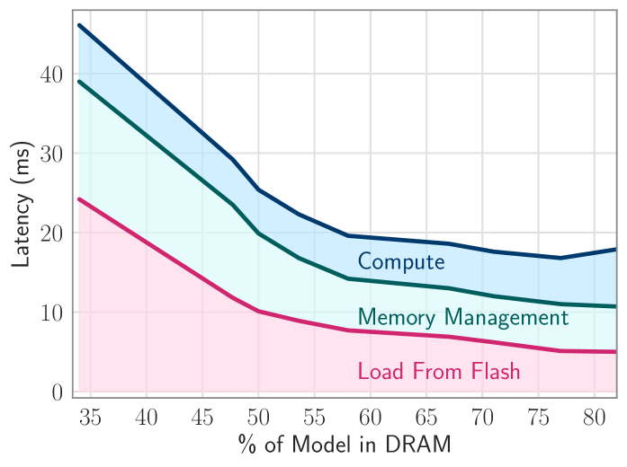

*图 7：内存-延迟权衡，显示随 DRAM 分配增加延迟降低*

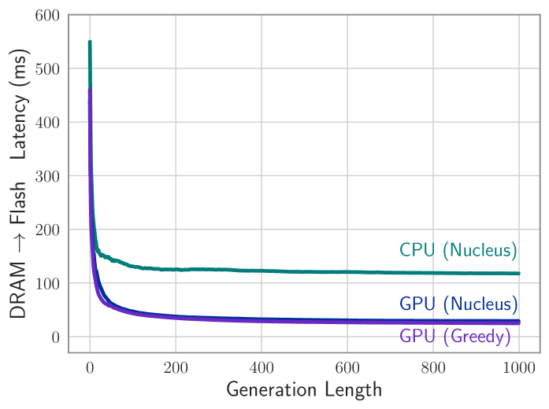

*图 8：OPT 6.7B 随生成长度增加的权重加载延迟*

### 3.2 Results / 实验结果

| Metric | CPU Backend | GPU Backend |
|--------|-------------|-------------|
| Speedup vs naive loading | 4-5x | 20-25x |
| DRAM occupancy | ~52% | ~52% |
| Model size capability | 2x available DRAM | 2x available DRAM |

- **CPU**: Achieves 4-5x latency improvement
- **GPU**: Achieves 20-25x speedup, reaching 84ms total per token on RTX 4090

| 指标 | CPU 后端 | GPU 后端 |
|------|----------|----------|
| 相比朴素加载的加速比 | 4-5 倍 | 20-25 倍 |
| DRAM 占用率 | ~52% | ~52% |
| 可运行模型大小 | 可用 DRAM 的 2 倍 | 可用 DRAM 的 2 倍 |

---

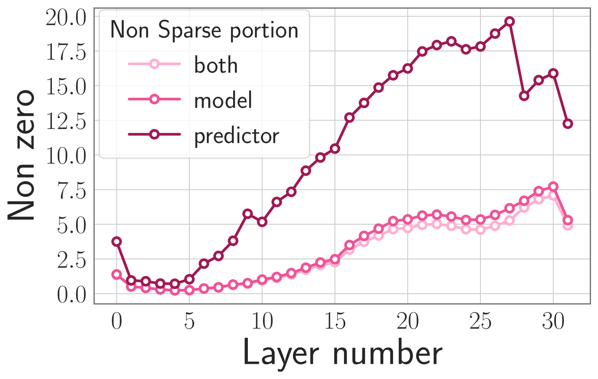
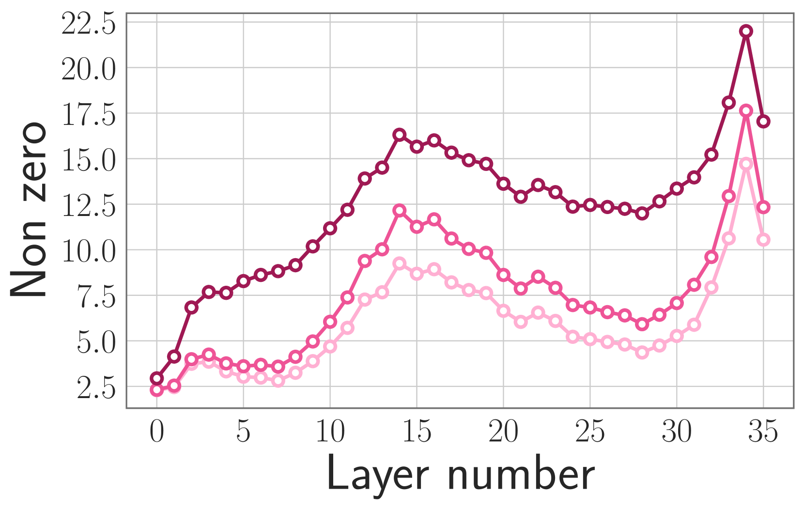
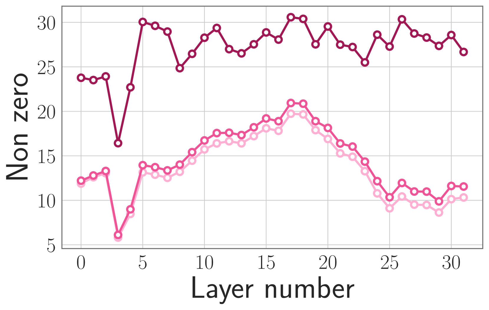
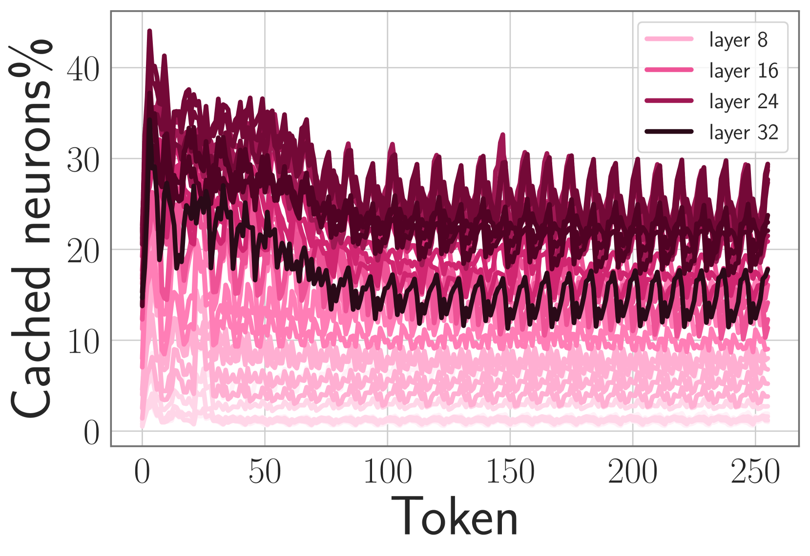

*图 9：多个模型中预测器和缓存行的稀疏性模式*

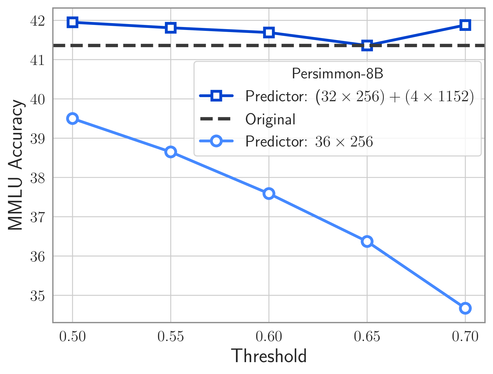
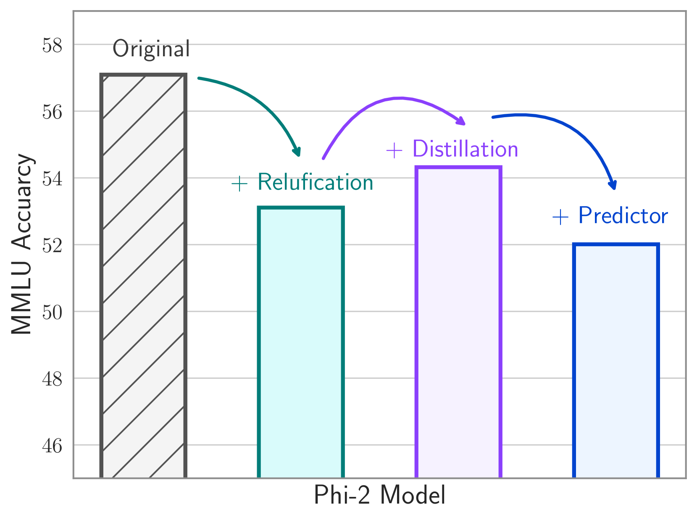

*图 10：Persimmon 和 Phi 模型在不同预测器配置下的 MMLU 性能指标*

---

## 4. Limitations / 局限性

- Focuses on single-batch inference only (仅关注单批次推理)
- Assumes model availability at 50% DRAM capacity (假设模型在 50% DRAM 容量下可用)
- Higher total energy consumption despite lower power draw due to extended generation time (尽管功耗较低，但由于生成时间延长，总能耗较高)
- Requires sparsified networks for optimization (需要稀疏化网络才能优化)

---

## 5. Conclusion / 结论

This work demonstrates a practical approach to deploying LLMs on memory-constrained devices by leveraging flash memory. The key insight is that by understanding hardware characteristics (flash memory's preference for sequential reads) and model characteristics (activation sparsity), it is possible to design an inference system that bridges the gap between model memory requirements and available DRAM. The techniques of windowing and row-column bundling represent a pragmatic convergence of hardware understanding and sparse neural network properties.

本文展示了一种通过利用 flash memory 在内存受限设备上部署 LLM 的实用方法。核心洞察是：通过理解硬件特性（flash memory 偏好顺序读取）和模型特性（激活稀疏性），可以设计一个推理系统来弥合模型内存需求与可用 DRAM 之间的差距。窗口化和行列捆绑技术代表了硬件理解与稀疏神经网络特性的务实融合。
