# TurboQuant: Online Vector Quantization with Near-optimal Distortion Rate

> **原文链接:** [arXiv:2504.19874](https://arxiv.org/abs/2504.19874)
>
> **Google Research 博客:** [TurboQuant: Redefining AI efficiency with extreme compression](https://research.google/blog/turboquant-redefining-ai-efficiency-with-extreme-compression/)
>
> **作者:** Amir Zandieh (Google Research), Majid Daliri (New York University), Majid Hadian (Google DeepMind), Vahab Mirrokni (Google Research)
>
> **发表:** ICLR 2026
>
> **主题:** 数据无关的在线向量量化方法，KV Cache 压缩至 3 bit 零精度损失，量化速度比乘积量化快 5-6 个数量级

---

## Abstract

Vector quantization aims to compress high-dimensional Euclidean vectors while minimizing distortion in their geometric structure. This paper introduces TurboQuant to address both mean-squared error (MSE) and inner product distortion, achieving near-optimal rates across all bit-widths and dimensions. The data-oblivious algorithms apply random rotations inducing concentrated Beta distributions on coordinates, leveraging near-independence in high dimensions to apply optimal scalar quantizers per coordinate. The approach combines MSE optimization with a 1-bit Quantized JL (QJL) transform on residuals for unbiased inner product estimation. Theoretical proofs demonstrate distortion rates within approximately 2.7x of information-theoretic lower bounds. Experiments validate findings on KV cache quantization achieving quality neutrality at 3.5 bits and marginal degradation at 2.5 bits, plus superior nearest neighbor search performance versus product quantization.

## 摘要

向量量化旨在压缩高维欧几里得向量的同时最小化其几何结构的失真。本文提出 TurboQuant 来同时解决均方误差 (MSE) 和内积失真问题，在所有位宽和维度下均实现近最优的失真率。该数据无关算法通过随机旋转在各坐标上诱导出集中的 Beta 分布，利用高维空间中不同坐标的近似独立性，对每个坐标应用最优标量量化器。该方法将 MSE 优化与残差上的 1-bit Quantized JL (QJL) 变换相结合，实现无偏的内积估计。理论证明失真率在信息论下界的约 2.7 倍以内。实验在 KV cache 量化中验证了上述发现——3.5 bit 时实现质量中性，2.5 bit 时仅有轻微退化，且在最近邻搜索中性能优于乘积量化。

---

## 1. Introduction / 引言

Vector quantization in Euclidean space is essential for efficiently handling high-dimensional vectors across computational domains, from training and deploying large-scale AI models to powering vector databases. The core objective is to compress high-dimensional vectors by converting floating-point coordinates to low-bitwidth integers while minimizing distortion metrics such as mean-squared error (MSE) or inner product errors.

欧几里得空间中的向量量化对于跨计算领域高效处理高维向量至关重要，从训练和部署大规模 AI 模型到支撑向量数据库。核心目标是通过将浮点坐标转换为低位宽整数来压缩高维向量，同时最小化均方误差 (MSE) 或内积误差等失真度量。

As large language models scale up, the key-value (KV) cache becomes a critical memory bottleneck during inference. The KV cache stores attention keys and values from previous tokens, growing linearly with sequence length and consuming substantial GPU memory. Traditional quantization methods either require data-dependent calibration (making them unsuitable for online/streaming scenarios) or sacrifice accuracy at aggressive compression rates.

随着大语言模型的扩展，键值 (KV) cache 在推理过程中成为关键的内存瓶颈。KV cache 存储来自先前 token 的注意力键和值，随序列长度线性增长，消耗大量 GPU 内存。传统量化方法要么需要数据依赖的校准（使其不适用于在线/流式场景），要么在激进压缩率下牺牲精度。

**Key Applications / 关键应用场景：**

- **AI Model Deployment / AI 模型部署：** Compressing model weights and activations reduces inference latency caused by communication bottlenecks between HBM and SRAM on accelerators or across distributed clusters. 压缩模型权重和激活值可减少加速器上 HBM 与 SRAM 之间或分布式集群间通信瓶颈导致的推理延迟。

- **Large Language Models / 大语言模型：** KV cache compression is essential as cache size scales with model size and context length, creating significant bottlenecks for memory usage and computational speed. KV cache 压缩至关重要，因为缓存大小随模型规模和上下文长度线性增长，给内存使用和计算速度带来严重瓶颈。

- **Nearest Neighbor Search / 最近邻搜索：** Vector databases fundamental to retrieval-augmented generation and information retrieval rely on efficient vector compression. 检索增强生成 (RAG) 和信息检索所依赖的向量数据库需要高效的向量压缩。

Existing vector quantization algorithms present a tradeoff: they either lack accelerator compatibility and exhibit slow computation unsuitable for real-time applications like KV cache quantization, or suffer from suboptimal distortion bounds relative to bit-width. TurboQuant addresses this gap by providing a theoretically grounded, data-oblivious quantization algorithm that operates near information-theoretic lower bounds while requiring zero preprocessing time.

现有的向量量化算法面临一个权衡：它们要么缺乏加速器兼容性且计算缓慢，不适用于 KV cache 量化等实时应用；要么在给定位宽下存在次优的失真上界。TurboQuant 通过提供一种理论上有保证的、数据无关的量化算法来填补这一空白，该算法在接近信息论下界的水平运行，同时不需要预处理时间。

---

## 2. Problem Definition / 问题定义

The goal is designing a quantization map Q: ℝᵈ → {0,1}ᴮ transforming d-dimensional vectors to B-bit binary strings. For B = b·d, the quantizer has bit-width b (average bits per coordinate). An inverse map Q⁻¹: {0,1}ᴮ → ℝᵈ performs dequantization, approximately reconstructing original vectors.

目标是设计一个量化映射 Q: ℝᵈ → {0,1}ᴮ，将 d 维向量转换为 B-bit 二进制字符串。当 B = b·d 时，量化器的位宽为 b（每个坐标的平均比特数）。逆映射 Q⁻¹: {0,1}ᴮ → ℝᵈ 执行反量化，近似重构原始向量。

**Two distortion metrics are considered / 考虑两种失真度量：**

- **MSE Distortion / 均方误差失真：** D_mse := E_Q[‖x − Q⁻¹(Q(x))‖₂²]
- **Inner Product Error / 内积误差：** D_prod := E_Q[|⟨y,x⟩ − ⟨y, Q⁻¹(Q(x))⟩|²]

For inner-product quantizers, unbiasedness is required: E_Q[⟨y, Q⁻¹(Q(x))⟩] = ⟨y,x⟩. This is critical for attention computation in transformers where inner products between queries and keys determine attention weights.

对于内积量化器，要求无偏性：E_Q[⟨y, Q⁻¹(Q(x))⟩] = ⟨y,x⟩。这对于 Transformer 中的注意力计算至关重要，因为查询和键之间的内积决定了注意力权重。

---

## 3. Related Work / 相关工作

### 3.1 Online vs Offline Quantization / 在线量化 vs 离线量化

Online (data-oblivious) methods apply instantly without data-specific tuning, contrasting with offline (data-dependent) methods requiring heavy preprocessing. Methods like GPTQ, AWQ, and SqueezeLLM all require calibration data. TurboQuant is an online method — it requires no calibration data, no fine-tuning, and no preprocessing of the input distribution.

在线（数据无关）方法无需针对数据进行调优即可即时应用，与需要大量预处理的离线（数据相关）方法形成对比。GPTQ、AWQ 和 SqueezeLLM 等方法都需要校准数据。TurboQuant 是一种在线方法——它不需要校准数据、不需要微调、也不需要对输入分布进行预处理。

### 3.2 Online KV Cache Compression / 在线 KV Cache 压缩

Existing approaches include architectural modifications, pruning/evicting redundant tokens, and quantization techniques. The QJL transform introduced efficient 1-bit quantization providing unbiased inner product estimates, which TurboQuant builds upon.

现有方法包括架构修改、剪枝/驱逐冗余 token，以及量化技术。QJL 变换引入了高效的 1-bit 量化，提供无偏的内积估计，TurboQuant 在此基础上进一步发展。

### 3.3 Product Quantization (PQ) / 乘积量化

Product quantization constructs quantization codebooks using k-means variations during indexing, making it unsuitable for online settings. Grid-based PQ methods eliminated preprocessing but suffer from suboptimal guarantees and lack GPU vectorization. As experiments will show, TurboQuant is 5-6 orders of magnitude faster than PQ for quantization.

乘积量化在索引阶段使用 k-means 变体构建量化码本，因此不适用于在线场景。基于网格的 PQ 方法消除了预处理，但存在次优的理论保证且缺乏 GPU 向量化支持。实验将证明，TurboQuant 的量化速度比 PQ 快 5-6 个数量级。

---

## 4. Core Methodology / 核心方法

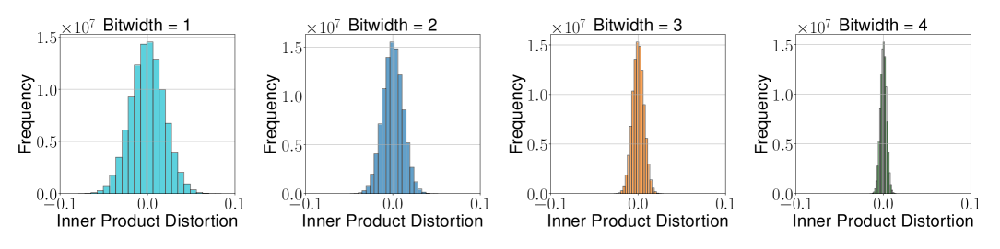
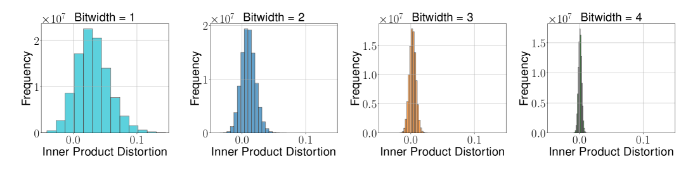

*图 1：TurboQuant_prod 和 TurboQuant_mse 的内积估计误差分布*

### 4.1 Key Insight: Random Rotation + Beta Distribution / 核心洞察：随机旋转 + Beta 分布

For a unit vector x on the unit sphere S^{d-1}, applying a random rotation Π creates Π·x uniformly distributed on the sphere. Each coordinate of the rotated vector follows a Beta distribution:

对于单位球面 S^{d-1} 上的单位向量 x，施加随机旋转 Π 使得 Π·x 均匀分布在球面上。旋转后向量的每个坐标服从 Beta 分布：

```
f_X(x) = Γ(d/2) / (√π · Γ((d−1)/2)) · (1−x²)^{(d−3)/2}
```

In high dimensions, this converges to N(0, 1/d). Crucially, distinct coordinates become nearly independent, enabling decomposition of the d-dimensional vector quantization problem into d independent scalar quantization problems.

在高维空间中，这收敛到 N(0, 1/d)。关键的是，不同坐标变得近似独立，使得 d 维向量量化问题可以分解为 d 个独立的标量量化问题。

**Intuition (PolarQuant) / 直觉（PolarQuant）：** Instead of standard Cartesian coordinates, TurboQuant converts vectors into polar-like coordinates — comparable to replacing "Go 3 blocks East, 4 blocks North" with "Go 5 blocks total at a 37-degree angle." The radius captures data strength, the angle captures direction/meaning. Since angle patterns are concentrated and predictable after random rotation, the model can use a fixed, optimal circular grid for quantization without needing to learn anything from the data.

**直觉（PolarQuant）：** TurboQuant 不使用标准的笛卡尔坐标，而是将向量转换为类极坐标表示——类比于将"向东走 3 个街区，向北走 4 个街区"替换为"沿 37 度角走 5 个街区"。半径捕获数据强度，角度捕获方向/语义。由于随机旋转后角度模式是集中且可预测的，模型可以使用固定的最优圆形网格进行量化，无需从数据中学习任何东西。

### 4.2 MSE-Optimal TurboQuant / MSE 最优 TurboQuant

Optimal scalar quantization is framed as a continuous 1D k-means problem, partitioning [−1,1] into 2^b clusters. The optimal codebooks are precomputed via the Max-Lloyd algorithm and stored for practical bit-widths.

最优标量量化被建模为一个连续的一维 k-means 问题，将 [−1,1] 划分为 2^b 个簇。最优码本通过 Max-Lloyd 算法预计算并存储，适用于实用位宽。

**Algorithm 1: TurboQuant_mse**

```
Global Setup:
  - Generate random rotation matrix Π
  - Construct codebook c₁, ..., c_{2^b} via Max-Lloyd algorithm

Quantize(x):
  y ← Π · x                          // 施加随机旋转
  idx_j ← argmin_k |y_j − c_k|       // 逐坐标最近码字
  return idx

Dequantize(idx):
  ỹ_j ← c_{idx_j}                    // 查表得到码字
  x̃ ← Πᵀ · ỹ                        // 逆旋转
  return x̃
```

**Theorem 1 / 定理 1：** For b-bit MSE-optimized TurboQuant with unit-norm vectors:

对于 b-bit MSE 最优 TurboQuant，作用于单位范数向量：

D_mse ≤ (√3 · π/2) · (1/4^b)

| Bit-width b / 位宽 b | MSE Upper Bound / MSE 上界 |
|-------------|-----------------|
| 1 | ~0.36 |
| 2 | ~0.117 |
| 3 | ~0.03 |
| 4 | ~0.009 |

Each additional bit reduces MSE by 4x. This exponential improvement is the key to achieving aggressive compression with minimal quality loss.

每增加 1 bit 位宽，MSE 降低为原来的 1/4。这种指数级改善是以最小质量损失实现激进压缩的关键。

### 4.3 Inner-Product Optimal TurboQuant / 内积最优 TurboQuant

TurboQuant_mse introduces bias for inner product estimation (approximately 2/π multiplicative bias at 1-bit). To correct this, the paper proposes a two-stage approach: first MSE-quantize with bit-width b−1, then apply QJL on the residual vector.

TurboQuant_mse 在内积估计中引入偏差（1-bit 时约 2/π 的乘性偏差）。为解决这一问题，论文提出两阶段方法：首先以位宽 b−1 进行 MSE 量化，然后对残差向量施加 QJL。

**QJL (Quantized Johnson-Lindenstrauss) / 量化 Johnson-Lindenstrauss 变换：**

QJL compresses a vector by projecting it through a random matrix S (with i.i.d. Gaussian entries) and keeping only the sign bits: Q_qjl(x) = sign(S·x). Dequantization: Q_qjl⁻¹(z) = (√(π/2)/d) · Sᵀ · z. This 1-bit quantization provides unbiased inner product estimates with variance bounded by (π/2d) · ‖y‖₂².

QJL 通过将向量投影到一个随机矩阵 S（i.i.d. 高斯元素）上并仅保留符号位来压缩向量：Q_qjl(x) = sign(S·x)。反量化：Q_qjl⁻¹(z) = (√(π/2)/d) · Sᵀ · z。这种 1-bit 量化提供无偏的内积估计，方差上界为 (π/2d) · ‖y‖₂²。

**Algorithm 2: TurboQuant_prod**

```
Global Setup:
  - Instantiate TurboQuant_mse with bit-width b−1
  - Generate random matrix S ∈ ℝ^{d×d}, S_{i,j} ~ N(0,1)

Quantize(x):
  idx ← Quant_mse(x)                          // 阶段 1：MSE 量化
  r ← x − DeQuant_mse(idx)                    // 计算残差
  qjl ← sign(S · r)                           // 阶段 2：对残差施加 QJL
  return (idx, qjl, ‖r‖₂)

Dequantize(idx, qjl, γ):
  x̃_mse ← DeQuant_mse(idx)                   // 从 MSE 重构
  x̃_qjl ← (√(π/2)/d) · γ · Sᵀ · qjl        // 通过 QJL 重构残差
  return x̃_mse + x̃_qjl                       // 合并两阶段
```

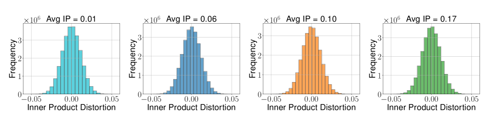
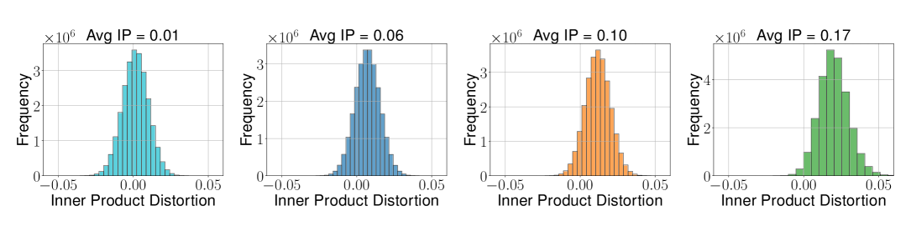

*图 2：TurboQuant_prod 的内积误差方差保持恒定，而 TurboQuant_mse 的方差随平均内积增加。比特宽度 b=2。*

**Theorem 2 / 定理 2：**

For b-bit inner-product TurboQuant:

对于 b-bit 内积 TurboQuant：

- **Unbiased / 无偏性：** E[⟨y, x̃⟩] = ⟨y,x⟩
- **Distortion bound / 失真上界：** D_prod ≤ (√3 · π² · ‖y‖₂²/d) · (1/4^b)

| Bit-width b / 位宽 b | Inner Product Distortion / 内积失真 |
|-------------|------------------------|
| 1 | ~1.57/d |
| 2 | ~0.56/d |
| 3 | ~0.18/d |
| 4 | ~0.047/d |

The distortion decreases with dimension d, meaning TurboQuant is especially effective in high-dimensional scenarios like LLM KV caches (where d is typically 128-256 per attention head).

失真随维度 d 的增大而减小，这意味着 TurboQuant 在高维场景（如 LLM 的 KV cache，每个注意力头通常为 128-256 维）中尤为有效。

**Proof Sketch / 证明概要：** The unbiasedness follows from the conditional expectation: E[⟨y, x̃⟩ | x̃_mse] = ⟨y, x̃_mse⟩ + ⟨y, r⟩ = ⟨y, x⟩. The variance bound uses the QJL variance bound (π/2d)·‖y‖₂²·‖r‖₂² combined with ‖r‖₂² ≤ D_mse of the (b−1)-bit MSE quantizer.

**证明概要：** 无偏性来自条件期望：E[⟨y, x̃⟩ | x̃_mse] = ⟨y, x̃_mse⟩ + ⟨y, r⟩ = ⟨y, x⟩。方差上界利用 QJL 方差界 (π/2d)·‖y‖₂²·‖r‖₂² 结合 (b−1)-bit MSE 量化器的 ‖r‖₂² ≤ D_mse。

---

## 5. Theoretical Bounds / 理论界

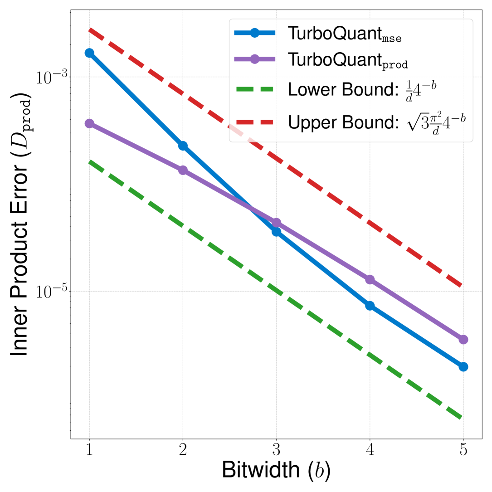
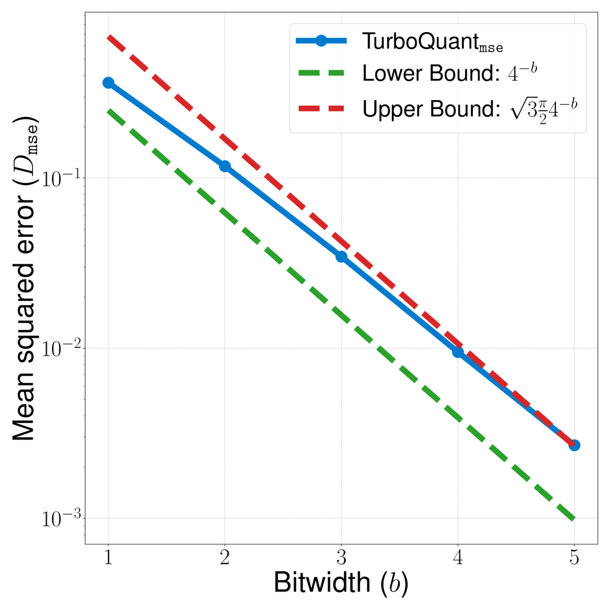

*图 3：不同比特率下内积误差和 MSE 与理论界的对比*

### 5.1 Shannon Lower Bound / Shannon 下界

For a random vector x ∈ ℝᵈ with finite differential entropy h(x), the MSE distortion-rate function for total bit complexity B ≥ 0:

对于具有有限微分熵 h(x) 的随机向量 x ∈ ℝᵈ，总比特复杂度 B ≥ 0 的 MSE 失真-速率函数为：

D(p_X, B) ≥ (d/(2πe)) · 2^{(2/d)(h(x)−B)}

For x uniformly distributed on the unit sphere S^{d-1}: D(B) ≥ 2^{−2B/d} = 1/4^b

对于均匀分布在单位球面 S^{d-1} 上的 x：D(B) ≥ 2^{−2B/d} = 1/4^b

### 5.2 Information-Theoretic Lower Bounds / 信息论下界

**Theorem 3 / 定理 3：** For any randomized quantization Q with bit-width b:

对于任意位宽为 b 的随机量化方案 Q：

- **MSE:** D_mse(Q) ≥ 1/4^b
- **Inner Product:** There exists y such that D_prod(Q) ≥ (1/d) · (1/4^b)

The proof uses Yao's minimax principle combined with the Shannon lower bound.

证明使用 Yao 极小极大原理结合 Shannon 下界。

### 5.3 Optimality Gap / 最优性差距

TurboQuant's MSE distortion differs from the information-theoretic lower bound by at most a factor of √3·π/2 ≈ 2.7x, reducing to ~1.45x at b=1. This means TurboQuant is provably close to the best any algorithm could ever achieve.

TurboQuant 的 MSE 失真与信息论下界之差不超过 √3·π/2 ≈ 2.7 倍，在 b=1 时缩小至约 1.45 倍。这意味着 TurboQuant 可证明地接近任何算法所能达到的最优水平。

| Metric / 指标 | TurboQuant Upper Bound / 上界 | Lower Bound / 下界 | Gap / 差距 |
|--------|-------|-------|------|
| MSE distortion | (√3π/2) · (1/4^b) | 1/4^b | ≤ 2.7x |
| Inner product distortion | (√3π²·‖y‖²/d) · (1/4^b) | (‖y‖²/d) · (1/4^b) | ≤ 2.7x |

---

## 6. Experiments / 实验

All experiments conducted on a single NVIDIA A100 GPU.

所有实验在单块 NVIDIA A100 GPU 上进行。

### 6.1 Empirical Validation / 实验验证

Dataset: DBpedia Entities, 1536-dimensional OpenAI3 embeddings, 100K training vectors and 1K queries.

数据集：DBpedia 实体，1536 维 OpenAI3 嵌入，100K 训练向量和 1K 查询向量。

Key findings:

关键发现：

- Increasing bit-width reduces variance in both methods. 增加位宽可降低两种方法的方差。
- TurboQuant_mse has bias for inner products that diminishes with increasing bit-width. TurboQuant_mse 对内积存在偏差，但偏差随位宽增加而减小。
- TurboQuant_prod remains unbiased across all bit-widths. TurboQuant_prod 在所有位宽下均保持无偏。
- Average inner product error and MSE align with theoretical predictions. 平均内积误差和 MSE 与理论预测一致。

### 6.2 Needle-In-A-Haystack / 大海捞针测试

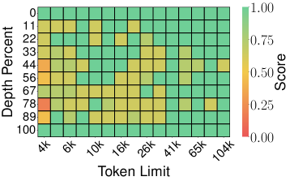
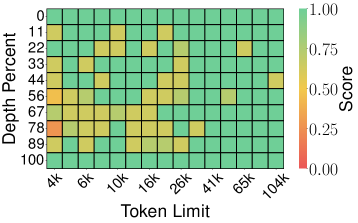
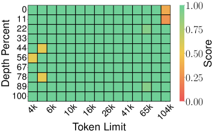
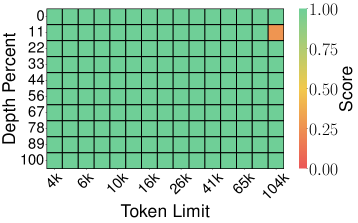


*图 4：Llama-3.1-8B-Instruct 在大海捞针测试上的评估，对比多种压缩方法（上下文长度 4K-104K，0.25 压缩比）*

| Method / 方法 | Score / 得分 |
|-------|-------|
| SnapKV | 0.858 |
| PyramidKV | 0.895 |
| KIVI | 0.981 |
| PolarQuant | 0.995 |
| Full-Precision / 全精度 | 0.997 |
| **TurboQuant** | **0.997** |

TurboQuant matches full-precision performance (0.997) at 4x memory compression, even at 104K token context length. This means zero information loss during quantization for this retrieval task.

TurboQuant 在 4 倍内存压缩下完美匹配全精度性能 (0.997)，即使在 104K token 的上下文长度下亦是如此。这意味着在该检索任务中量化过程零信息丢失。

### 6.3 End-to-end Generation on LongBench / LongBench 端到端生成

**Llama-3.1-8B-Instruct:**

| Method / 方法 | KV Size (bits) / KV 大小 (bit) | Average Score / 平均得分 |
|-------|------------|---------------|
| Full Cache / 全精度 | 16 | 50.06 |
| KIVI | 3 | 48.50 |
| KIVI | 5 | 50.16 |
| PolarQuant | 3.9 | 49.78 |
| **TurboQuant** | **2.5** | **49.44** |
| **TurboQuant** | **3.5** | **50.06** |

TurboQuant at 3.5 bits achieves exactly the same score as full 16-bit precision (50.06 = 50.06). At 2.5 bits (6.4x compression), only marginal degradation (49.44 vs 50.06). In comparison, KIVI needs 5 bits to achieve comparable quality.

TurboQuant 在 3.5 bit 时取得与 16-bit 全精度完全相同的得分（50.06 = 50.06）。在 2.5 bit（6.4 倍压缩）时仅有轻微退化（49.44 vs 50.06）。相比之下，KIVI 需要 5 bit 才能达到可比的质量。

**Ministral-7B-Instruct:**

| Method / 方法 | KV Size (bits) / KV 大小 (bit) | Average Score / 平均得分 |
|-------|------------|---------------|
| Full Cache / 全精度 | 16 | 49.89 |
| **TurboQuant** | **2.5** | **49.62** |

TurboQuant 2.5-bit achieves 49.62 on Ministral-7B, virtually indistinguishable from full precision 49.89.

TurboQuant 2.5 bit 在 Ministral-7B 上得分 49.62，与全精度 49.89 几乎无差异。

### 6.4 Nearest Neighbor Search / 最近邻搜索

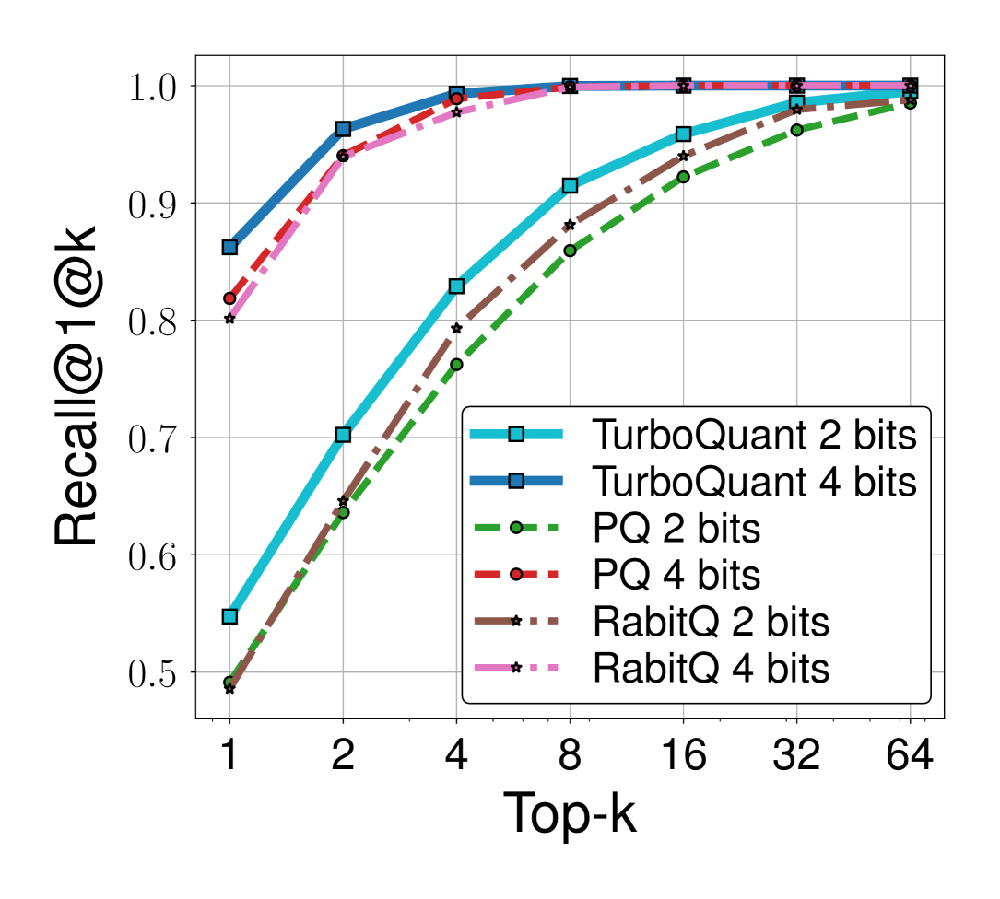

*图 5a：GloVe 数据集 (d=200) 上的召回率对比*

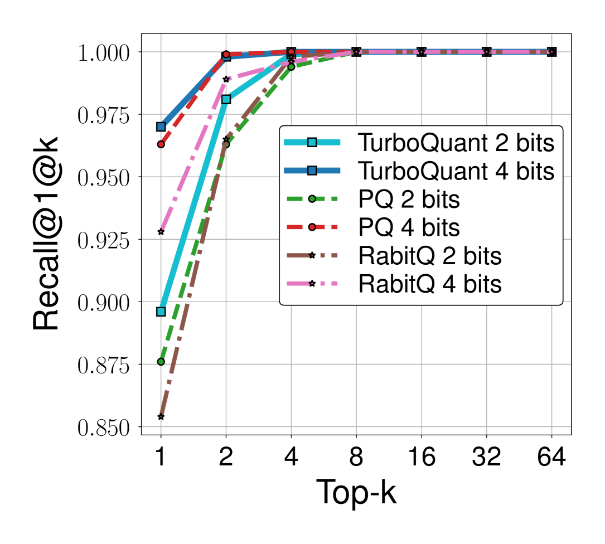

*图 5b：OpenAI3 数据集 (d=1536) 上的召回率对比*

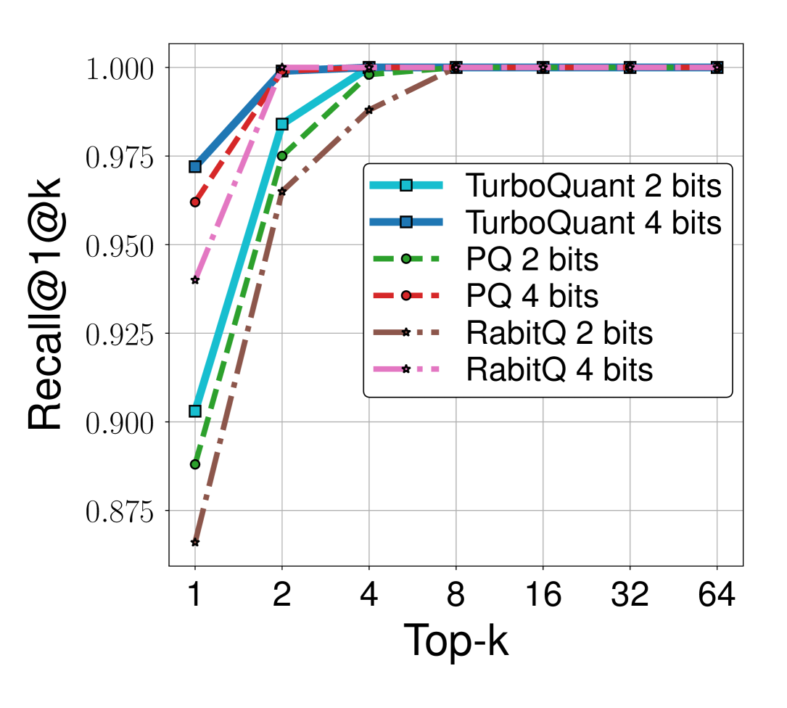

*图 5c：OpenAI3 数据集 (d=3072) 上的召回率对比*

**Quantization Time (seconds) for 4-bit / 4-bit 量化时间（秒）：**

| Approach / 方法 | d=200 | d=1536 | d=3072 |
|---------|-------|--------|--------|
| Product Quantization | 37.04 | 239.75 | 494.42 |
| RabitQ | 597.25 | 2267.59 | 3957.19 |
| **TurboQuant** | **0.0007** | **0.0013** | **0.0021** |

TurboQuant is 5-6 orders of magnitude faster for quantization than both Product Quantization and RabitQ, while consistently achieving superior or comparable recall rates. This massive speed advantage comes from TurboQuant's data-oblivious nature: it requires no k-means clustering or any form of data-dependent preprocessing. The codebooks are precomputed once and reused for all inputs.

TurboQuant 的量化速度比乘积量化和 RabitQ 快 5-6 个数量级，同时在召回率上始终保持优于或可比的水平。这种巨大的速度优势来自 TurboQuant 的数据无关特性：它不需要 k-means 聚类或任何形式的数据相关预处理。码本一次性预计算，可复用于所有输入。

### 6.5 Hardware Acceleration / 硬件加速

On NVIDIA H100 GPUs, 4-bit TurboQuant achieves up to 8x performance increase over 32-bit unquantized keys for computing attention logits. The method's design is inherently accelerator-friendly: the core operations (random rotation, per-coordinate lookup, inverse rotation) are all embarrassingly parallel and map naturally to SIMD/GPU architectures.

在 NVIDIA H100 GPU 上，4-bit TurboQuant 在计算注意力 logits 时相比 32-bit 未量化的 key 实现了最高 8 倍的性能提升。该方法的设计天然适合加速器：核心操作（随机旋转、逐坐标查表、逆旋转）都是高度并行的，能自然映射到 SIMD/GPU 架构上。

---

## 7. Advantages Over Existing Methods / 相对现有方法的优势

| Feature / 特性 | TurboQuant | Traditional Methods / 传统方法 |
|---------|------------|---------------------|
| Data dependency / 数据依赖 | Data-oblivious (数据无关) | Requires calibration data (需要校准数据) |
| Preprocessing time / 预处理时间 | Zero (零) | Significant (显著) |
| Online/streaming support / 在线支持 | Native (原生支持) | Limited (有限) |
| Theoretical guarantees / 理论保证 | Provably near-optimal (可证明近最优) | Heuristic (启发式) |
| Training required / 是否需要训练 | None (无需) | Often required (通常需要) |
| Quantization speed / 量化速度 | O(d·log d) per vector | O(n·d·k) for PQ |
| Accelerator-friendly / 加速器友好 | Yes, embarrassingly parallel | Often requires custom kernels |

---

## 8. Design Insights / 设计洞察

### Why TurboQuant Works / TurboQuant 为何有效

1. **Random rotation normalizes distribution / 随机旋转归一化分布：** Instead of dealing with arbitrary, unknown input distributions, random rotation transforms any unit vector into a well-characterized, predictable distribution (concentrated Beta → approximately Gaussian). This eliminates the need for data-dependent calibration entirely.

1. **随机旋转归一化分布：** 无需处理任意的未知输入分布，随机旋转将任意单位向量转换为特征明确、可预测的分布（集中 Beta → 近似高斯）。这完全消除了对数据相关校准的需求。

2. **High-dimensional near-independence / 高维近似独立性：** In high dimensions, the coordinates of a uniformly random point on the sphere become nearly independent. This is the key mathematical insight that allows decomposing the vector quantization problem into d independent scalar quantization problems — a dramatic simplification.

2. **高维近似独立性：** 在高维空间中，球面上均匀随机点的各坐标变得近似独立。这是允许将向量量化问题分解为 d 个独立标量量化问题的关键数学洞察——一个极大的简化。

3. **Two-stage decomposition for inner products / 内积的两阶段分解：** MSE-optimal quantization introduces bias in inner products. The elegant solution — MSE-quantize first, then apply QJL on the residual — achieves unbiasedness while keeping total bit-width at b. The residual after MSE quantization is small, so the QJL variance is also small.

3. **内积的两阶段分解：** MSE 最优量化在内积中引入偏差。优雅的解决方案是——先进行 MSE 量化，然后对残差施加 QJL——在保持总位宽为 b 的同时实现无偏性。MSE 量化后的残差很小，因此 QJL 的方差也很小。

### Engineering Implications / 工程启示

- **No calibration data needed / 无需校准数据：** Unlike GPTQ, AWQ, or SqueezeLLM, TurboQuant requires zero training samples. This makes it immediately applicable to any new model without any setup cost.
- **无需校准数据：** 与 GPTQ、AWQ 或 SqueezeLLM 不同，TurboQuant 不需要任何训练样本。这使得它可以立即应用于任何新模型，零准备成本。

- **Constant-time quantization / 常数时间量化：** Each vector is quantized in O(d·log d) time (dominated by the random rotation), independent of dataset size. This is fundamentally different from PQ which requires O(n·d·k) for k-means.
- **常数时间量化：** 每个向量的量化时间为 O(d·log d)（由随机旋转主导），与数据集大小无关。这与需要 O(n·d·k) 进行 k-means 的乘积量化有本质不同。

- **Memory savings compound at scale / 内存节省在规模化时叠加：** At 3.5 bits per channel (vs 16-bit full precision), KV cache memory is reduced by ~4.6x. For long-context LLM serving, this directly translates to either longer supported context or higher throughput per GPU.
- **内存节省在规模化时叠加：** 在每通道 3.5 bit（对比 16-bit 全精度）时，KV cache 内存减少约 4.6 倍。对于长上下文 LLM 服务，这直接转化为更长的支持上下文或每 GPU 更高的吞吐量。

---

## 9. Conclusion / 结论

TurboQuant provides a principled, efficient approach to vector quantization achieving near-optimal distortion rates. Random rotation followed by independent scalar quantization leverages high-dimensional geometry effectively. For inner product queries, combining MSE optimization with QJL on residuals yields unbiased estimates. Theoretical analysis demonstrates distortion within 2.7x of information-theoretic lower bounds.

TurboQuant 提供了一种原则性的、高效的向量量化方法，实现了近最优的失真率。随机旋转后进行独立标量量化，有效利用了高维几何特性。对于内积查询，将 MSE 优化与残差上的 QJL 结合产生无偏估计。理论分析表明失真在信息论下界的 2.7 倍以内。

The method's data-oblivious nature, accelerator-friendly design, and minimal indexing overhead make it suitable for online applications in modern AI systems. Its key strengths — zero calibration cost, theoretically optimal compression, and immediate applicability to any model — position TurboQuant as a fundamental building block for efficient LLM inference and vector search at scale.

该方法的数据无关特性、加速器友好的设计以及极低的索引开销，使其适用于现代 AI 系统中的在线应用。其核心优势——零校准成本、理论最优压缩、对任何模型的即时适用性——使 TurboQuant 成为高效 LLM 推理和大规模向量搜索的基础构建模块。

The key takeaway for practitioners: TurboQuant achieves the holy grail of quantization — zero accuracy loss at aggressive compression ratios — without requiring any calibration or fine-tuning. Its 3.5-bit KV cache quantization matching full-precision quality, combined with 8x attention speedup on H100 GPUs, makes it immediately practical for production LLM serving.

对从业者的关键启示：TurboQuant 实现了量化的终极目标——在激进的压缩比下零精度损失——且无需任何校准或微调。其 3.5-bit KV cache 量化匹配全精度质量，加上在 H100 GPU 上 8 倍的注意力加速，使其可直接用于生产环境的 LLM 服务。
